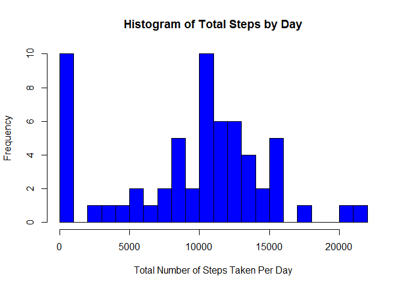
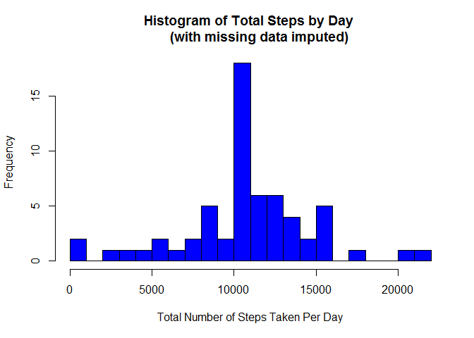
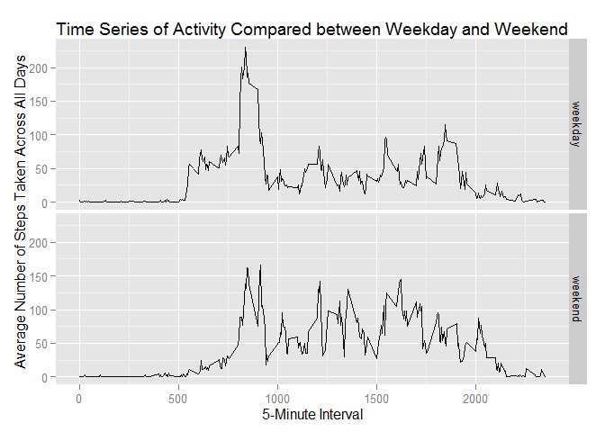

# Reproducible Research: Peer Assessment 1


## Part I: Loading and preprocessing the data

In this part, I set the working directory, load the data and look at the dimensions and summary information of variables in the data file.


```r
setwd("G:/study/coursera/DataScience Specialization/Reproducible research")
dt <- read.csv("activity.csv")
str(dt)
```

```
## 'data.frame':	17568 obs. of  3 variables:
##  $ steps   : int  NA NA NA NA NA NA NA NA NA NA ...
##  $ date    : Factor w/ 61 levels "2012-10-01","2012-10-02",..: 1 1 1 1 1 1 1 1 1 1 ...
##  $ interval: int  0 5 10 15 20 25 30 35 40 45 ...
```

## Part II: What is mean total number of steps taken per day?

This part performs three tasks while ignoring the missing values:
1. Calculate the total number of steps taken per day, 
2. Make a histogram of the total number of steps taken per day, 
3. Calculate and report the mean and median of the total number of steps taken per day.


```r
StepbyDay <- aggregate(dt$steps, by=list(dt$date), FUN=sum, na.rm=TRUE)
hist(StepbyDay$x, main = "Histogram of Total Steps by Day", xlab = "Total Number of Steps Taken Per Day", ylab="Frequency", breaks = 20, col = "blue")
```

 

```r
stepmean <- mean(StepbyDay$x, na.rm = TRUE)
stepmedian <- median(StepbyDay$x, na.rm = TRUE)
```

The mean of total number of steps taken per day is 9354.2295082, and the median of total number of steps taken per day is 10395.

## Part III: What is the average daily activity pattern?

This part performs two tasks while ignoring the missing values:
1. Make a time series plot of the 5-minute interval and the average number of steps taken averaged across all days, 
2. Find the 5-minute interval that contains the maximum number of average steps.


```r
library(ggplot2)
```

```
## Warning: package 'ggplot2' was built under R version 3.2.2
```

```r
AvgStepbyInt <- aggregate(x = list(steps = dt$steps), by = list(interval = dt$interval), FUN = mean, na.rm = TRUE)
g1 <- ggplot(data = AvgStepbyInt, aes(x=interval, y=steps))
g2 <- g1 + geom_line() + xlab("5-Minute Interval") + ylab("Average Number of Steps Taken Across All Days")
g3 <- g2 + ggtitle("Time Series of Activity")
maxint <- AvgStepbyInt[which.max(AvgStepbyInt$steps), ][1]
maxstep <- AvgStepbyInt[which.max(AvgStepbyInt$steps), ][2]
```

The 5-minute interval that contains the maximum number of average steps is interval 835, which has 206.1698113 steps. 

Note that although there is a warning message telling me that package 'ggplot2' was built under R version 3.2.2, it does not affect the normal processing of the codes and therefore can be ignored.


## Part IV: Imputing missing values

In this part, I will write a function for imputing missing values in the given data file. I will impute the missing values with the mean for that 5-minute interval.

This part perfroms four subtasks: 
1. Calculate and report the total number of missing values (from Part I results, I got to know that only the variable steps has missing data), 
2. Impute the missing values with the mean for that 5-minute interval, 
3. Create a new dataset "dt.imp" with the missing values filled in, 
4. Repeat the tasks in Part II and compare the results with those obtained in Part II.


```r
st <- dt[dt$steps == "NA", ]
nmis <- length(st$steps)

imputed.steps <- function (x, y){
  imp <- NA
  if (!is.na(x)) imp <- c(x)
  else imp <- (AvgStepbyInt[AvgStepbyInt$interval == y, "steps"])
  return(imp)
}

dt.imp <- dt
# apply the function on each value of steps and corresponding interval in the original dataset
dt.imp$steps <- mapply(imputed.steps, dt$steps, dt$interval)
dim(dt.imp)
```

```
## [1] 17568     3
```

```r
# now make the histogram and calculate the mean and median based on the new dataset
StepbyDay <- aggregate(dt.imp$steps, by=list(dt.imp$date), FUN=sum)
hist(StepbyDay$x, main = "Histogram of Total Steps by Day 
     (with missing data imputed)", xlab = "Total Number of Steps Taken Per Day", ylab="Frequency", breaks = 20, col = "blue")
```

 

```r
stepmean <- mean(StepbyDay$x, na.rm = TRUE)
stepmedian <- median(StepbyDay$x, na.rm = TRUE)
```

The 2304 missing values are now imputed. Both mean and median are higher than those calculated based on the original dataset. 


## Part V: Are there differences in activity patterns between weekdays and weekends?

This part performs two subtasks: 
1. Create a new factor variable indicating weekday and weekend,
2. Make a panel plot comparing the time series of activity patterns between weekday and weekend.


```r
dt.imp$day <- weekdays(as.Date(dt.imp$date))
dt.imp$daytype <- "weekday"
flag <- (dt.imp$day %in% c("Saturday", "Sunday")) 
dt.imp$daytype[flag == TRUE] <- "weekend"
table(dt.imp$daytype)
```

```
## 
## weekday weekend 
##   12960    4608
```

```r
# make the daytype variable a factor
dt.imp$daytype <- as.factor(dt.imp$daytype)
class(dt.imp$daytype)
```

```
## [1] "factor"
```

```r
# create an aggregate dataset by two variables
AvgStepbyInt <- aggregate(steps ~ interval + daytype, data = dt.imp, FUN = mean)
g1 <- ggplot(data = AvgStepbyInt, aes(x=interval, y=steps))
g2 <- g1 + geom_line() + facet_grid(daytype ~ .) + xlab("5-Minute Interval") + ylab("Average Number of Steps Taken Across All Days")
g3 <- g2 + ggtitle("Time Series of Activity Compared between Weekday and Weekend")
g3
```

 

This is the end of the document.

